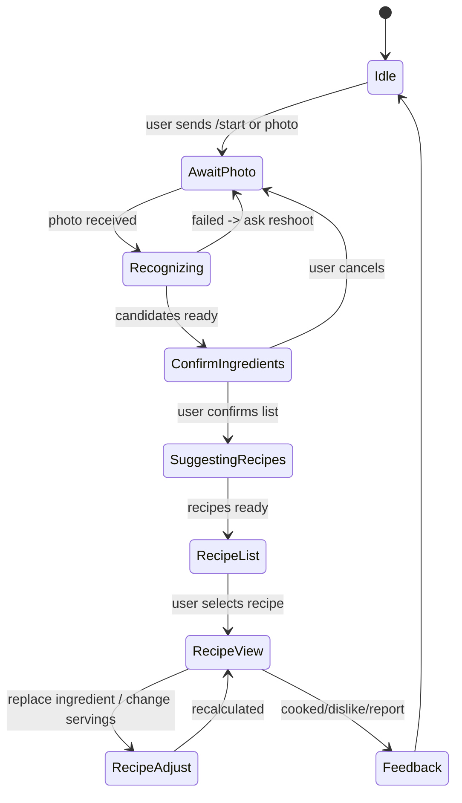
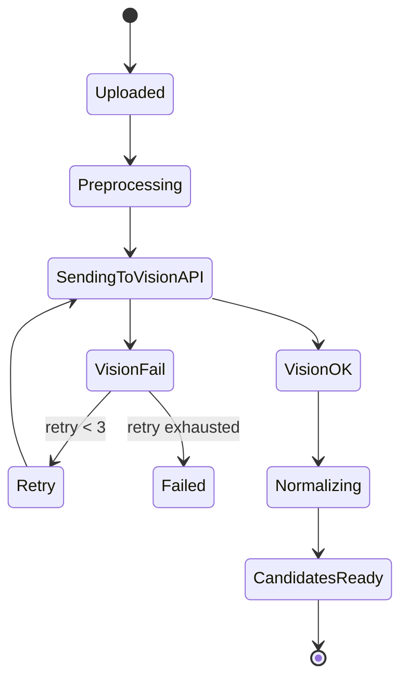
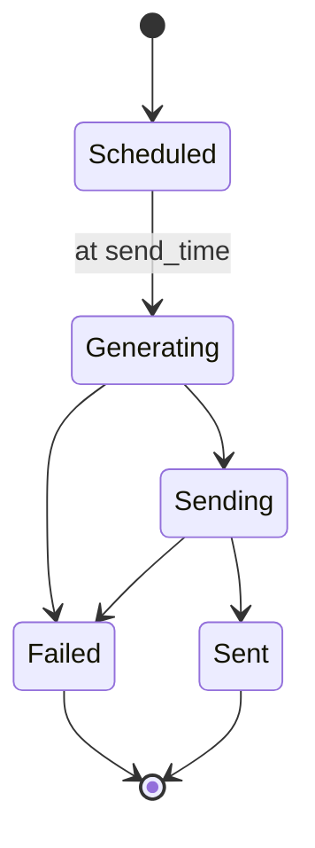

# Техническое задание (ТЗ)

Проект: «ИИ-повар в чат-боте телеграмм: фото продуктов → рецепты с КБЖУ + ежедневные сезонные подборки»  
Версия: 1.0 (MVP)  
Дата: 28.01.2026  
Исполнитель: (команда разработки)  
Заказчик: (владелец продукта)

## Лист согласования

Заказчик: __________________ / дата ..____  
Исполнитель: _______________ / дата ..____

## 1. Общие сведения

### 1.1. Наименование системы

Информационная система «ИИ-повар» (далее — Система).

### 1.2. Назначение

Система предназначена для автоматического распознавания продуктов по фото, формирования предложений рецептов с расчётом КБЖУ и регулярной отправки ежедневных универсальных подборок из сезонных блюд.

### 1.3. Основания для разработки

Потребность пользователей в ежедневном принятии решения “что приготовить” и снижении когнитивной нагрузки за счёт автоматизации подбора блюд.

### 1.4. Термины и сокращения

- КБЖУ — калории, белки, жиры, углеводы.
- Распознавание — извлечение списка объектов/продуктов с вероятностями из изображения.
- Нормализация — приведение распознанных сущностей к внутреннему словарю ингредиентов.
- MVP — минимально жизнеспособная версия.

## 2. Цели и показатели эффективности

### 2.1. Цели

- Ускорить получение вариантов блюд из имеющихся продуктов.
- Поддержать пользователей с целями питания (КБЖУ).
- Повысить регулярность использования через ежедневные подборки.

### 2.2. KPI (целевые для MVP)

- Время “фото → список распознанного” (P95) ≤ 8 сек.
- Время “подтверждение → 3 рецепта” (P95) ≤ 10 сек.
- D1 retention ≥ 25% (ориентир), D7 ≥ 10% (ориентир).
- Доля подтверждённых распознаваний ≥ 70% на типовых фото (ориентир).

## 3. Характеристики объекта автоматизации

Объект автоматизации — бытовой процесс выбора и приготовления еды в домашних условиях при ограничении времени и наличия продуктов.

## 4. Требования к системе

### 4.1. Функциональные требования (FR)

#### 4.1.1. Канал взаимодействия (чат-бот)

- FR-1: Система должна работать как чат-бот (MVP: Telegram).
- FR-2: Система должна принимать:
  - фото,
  - текстовые сообщения,
  - нажатия на inline-кнопки.
- FR-3: Система должна хранить состояние диалога (стадия: распознавание / подтверждение / выбор рецепта / рецепт / обратная связь).

#### 4.1.2. Профиль пользователя и настройки

- FR-10: Онбординг: сбор параметров профиля:
  - цель (похудение/поддержание/набор) или макро-цели (ккал/Б/Ж/У),
  - ограничения/аллергии,
  - предпочтения/нелюбимые продукты,
  - доступная техника (плита/духовка/микроволновка и т.д.),
  - желаемое время готовки,
  - регион (для сезонности).
- FR-11: Команда /profile (или кнопка) — просмотр и редактирование профиля.

#### 4.1.3. Приём и обработка фото

- FR-20: Пользователь отправляет фото. Система должна:
  - принять файл,
  - выполнить предобработку,
  - отправить в сервис распознавания,
  - получить кандидатов продуктов (label + confidence),
  - нормализовать к словарю ингредиентов,
  - вернуть пользователю список для подтверждения.
- FR-21: Подтверждение распознанного списка:
  - пользователь может снять/поставить галочки,
  - добавить ингредиент вручную,
  - переименовать спорный ингредиент (через быстрые варианты).
- FR-22: При низком качестве фото система должна предложить переснять с подсказками (свет/фон/дистанция).

#### 4.1.4. Генерация предложений рецептов

- FR-30: После подтверждения ингредиентов система должна выдать 3–5 рецептов.
- FR-31: Каждый рецепт в списке должен содержать минимум:
  - название,
  - время,
  - порции,
  - краткое описание,
  - КБЖУ на порцию,
  - индикатор “использует X из ваших продуктов”, “нужно докупить Y (опционально)”.
- FR-32: Пользователь выбирает рецепт — система показывает подробную карточку:
  - ингредиенты (граммы),
  - шаги,
  - КБЖУ (на блюдо и на порцию),
  - замены (минимум 2 для ключевых ингредиентов),
  - кнопки: “Изменить порции”, “Заменить ингредиент”, “В избранное”, “Готовил”.
- FR-33: Ограничения должны соблюдаться:
  - аллергены исключаются,
  - техника учитывается,
  - время готовки учитывается,
  - предпочтения учитываются.

#### 4.1.5. Расчёт КБЖУ

- FR-40: Система должна вычислять КБЖУ по ингредиентам и суммарно по рецепту.
- FR-41: Система должна поддерживать пересчёт:
  - при изменении порций,
  - при замене ингредиента,
  - при уточнении формы продукта (например: сырой/готовый продукт — если требуется).
- FR-42: При невозможности точного расчёта Система должна:
  - показывать предупреждение “оценка приблизительная”,
  - указывать допущения (например, “масло 10 г”).

#### 4.1.6. Ежедневные сезонные подборки

- FR-50: Система должна отправлять пользователю ежедневную подборку (1 раз в день).
- FR-51: Подборка должна учитывать:
  - профиль (аллергии/цели),
  - сезонность по региону,
  - разнообразие (не повторять блюда слишком часто).
- FR-52: В сообщении подборки должны быть кнопки:
  - “Показать подробнее рецепт #N”
  - “Сделай все до 20 минут”
  - “Заменить подборку”
  - “Список покупок”

#### 4.1.7. История и обратная связь

- FR-60: История: фото → подтверждённые ингредиенты → выбранные рецепты.
- FR-61: Избранное.
- FR-62: Обратная связь:
  - “распознано неверно”,
  - “рецепт не понравился”,
  - “ошибка/баг”.

### 4.2. Требования к интерфейсам (IR)

#### 4.2.1. Пользовательские сообщения (MVP шаблоны)

- Подтверждение распознавания: “Я вижу: 🍅 помидор, 🧀 сыр, 🥚 яйца… Подтверди/исправь.”
- Выбор рецепта: “Вот 3 варианта на 20 минут…”
- Карточка рецепта: “КБЖУ на порцию: … / на всё: …”

#### 4.2.2. Админ-панель

Web-интерфейс: управление словарём, правилами нормализации, просмотр ошибок и метрик.

### 4.3. Требования к данным (DR)

#### 4.3.1. Основные сущности

- User, UserPreferences
- PhotoUpload
- IngredientDictionary (словарь), IngredientSynonyms
- RecognitionResult (raw labels) + NormalizedIngredients
- Recipe (generated/curated), RecipeIngredient
- NutritionCache (по ингредиентам)
- DailyDigestSchedule, DailyDigestSendLog
- Feedback

#### 4.3.2. Хранение изображений

- DR-10: Фото хранить в объектном хранилище (S3-совместимом).
- DR-11: TTL хранения фото для MVP: по умолчанию 14 дней (настраиваемо).
- DR-12: В БД хранить ссылку + метаданные + статус, само фото — только в storage.

### 4.4. Нефункциональные требования (NFR)

#### 4.4.1. Производительность

- NFR-1: P95 “фото → кандидаты” ≤ 8 сек.
- NFR-2: P95 “подтверждение → рецепты” ≤ 10 сек.
- NFR-3: Одновременная нагрузка (MVP): 50 активных пользователей/мин (ориентир).

#### 4.4.2. Надёжность

- NFR-10: Повторяемость задач очереди: распознавание и генерация рецептов должны иметь retry (например 3 попытки).
- NFR-11: Идемпотентность: повторная доставка webhook не должна ломать состояние.

#### 4.4.3. Безопасность

- NFR-20: Секреты в ENV/Secret Manager, не в коде.
- NFR-21: HTTPS для всех внешних запросов.
- NFR-22: Ограничение размеров файлов и rate-limit на пользователя.
- NFR-23: Логи без персональных данных и без бинарных фото.

#### 4.4.4. Наблюдаемость

- NFR-30: Структурированные логи (JSON), корреляционный id на запрос.
- NFR-31: Метрики latency по этапам + ошибки внешних API.
- NFR-32: Трейсы (опционально) через OpenTelemetry.

## 5. Требования к составу и архитектуре (Node.js)

### 5.1. Рекомендуемый стек (MVP)

- Node.js 20+
- DB: MariaDB

### 5.2. Модули/сервисы

- Bot Gateway (webhook для Telegram)
- Core API (профиль, состояние диалога, рецепты)
- Image Service (предобработка, вызов Vision API, нормализация)
- Nutrition Service (поиск нутриентов, кэш, расчёт КБЖУ)
- Recipe Engine (логика формирования вариантов; можно LLM/шаблоны)
- Scheduler (ежедневные подборки, repeatable jobs в BullMQ)
- Admin Panel

### 5.3. Очереди (обязательно)

- image.recognize — обработка фото
- recipe.generate — генерация и ранжирование рецептов
- digest.send — рассылка ежедневных подборок

## 6. Диаграммы состояний (MVP)

### 6.1. Диалог пользователя (высокоуровнево)

### 6.2. Обработка фото (backend)

### 6.3. Ежедневная подборка

## 7. Порядок контроля и приемки (испытания)

### 7.1. Виды испытаний

- Модульные (unit) — сервисы расчёта КБЖУ, нормализация, ранжирование.
- Интеграционные — webhook → storage → очередь → Vision API → ответ.
- Системные — полный сценарий пользователя.
- Нагрузочные (минимум) — прогон очередей, P95 latency.
- Безопасность (минимум) — секреты, rate-limit, ограничения размера.

### 7.2. Приемочные критерии MVP (Definition of Done)

MVP считается готовым, если выполнено:

**Функционально:**

- Пользователь может: онбординг → отправить фото → подтвердить продукты → получить 3–5 рецептов → открыть рецепт → получить КБЖУ → заменить ингредиент → пересчитать.
- Ежедневная подборка отправляется по расписанию и кликабельна.
- Есть история (минимально: последние 10 действий) и избранное.

**Качество/устойчивость:**

- Ошибки внешнего Vision API обрабатываются (retry + понятное сообщение).
- Очереди не “теряют” задачи.
- Логи и метрики позволяют понять, где тормозит.

**Производительность:**

- P95 “фото → кандидаты” ≤ 8 сек на тестовом окружении с реальным Vision API.
- P95 “подтверждение → рецепты” ≤ 10 сек.

**Безопасность:**

- Фото не попадает в логи, доступ к storage по подписанным URL или приватный бакет.
- Rate-limit на пользователя включён.

### 7.3. Порядок приемки

- Исполнитель предоставляет: ссылку на тестового бота + тестовые учётки админки + отчёт по тестам.
- Заказчик проходит чек-лист приемки (раздел 8) на реальных фото.
- Фиксация замечаний.
- Повторная проверка.
- Подписание акта приемки MVP.

## 8. Тест-кейсы (приемочные + критические)

Формат: TC-ID / Предусловия / Шаги / Ожидаемый результат

### 8.1. Основные

- TC-01 Онбординг минимальный
  - Предусловия: новый пользователь
  - Шаги: /start → выбрать цель “поддержание” → указать аллергию “орехи” → техника “только плита”
  - Ожидаемо: профиль сохранён, предлагается отправить фото
- TC-02 Приём фото и кандидаты
  - Шаги: отправить фото продуктов
  - Ожидаемо: сообщение “я вижу …” + список с кнопками подтвердить/исправить
- TC-03 Ручное исправление
  - Шаги: снять галочку с одного продукта, добавить “рис” вручную
  - Ожидаемо: список обновлён, продолжение доступно
- TC-04 Генерация рецептов
  - Шаги: подтвердить список
  - Ожидаемо: 3–5 рецептов, у каждого время + КБЖУ + “использует X ингредиентов”
- TC-05 Карточка рецепта
  - Шаги: открыть рецепт #1
  - Ожидаемо: ингредиенты с граммами, шаги, КБЖУ на порцию/всё, кнопки действий
- TC-06 Замена ингредиента с пересчётом
  - Шаги: “Заменить” → выбрать замену → подтвердить
  - Ожидаемо: ингредиенты и КБЖУ пересчитаны, указана замена
- TC-07 Ограничения по технике
  - Предусловия: в профиле “нет духовки”
  - Шаги: подтвердить ингредиенты
  - Ожидаемо: рецепты без духовки (или пометка “требует духовку” отсутствует)
- TC-08 Аллергены
  - Предусловия: аллергия “орехи”
  - Шаги: список содержит “арахис” / или рецепт мог бы включить орехи
  - Ожидаемо: орехи исключены / предложена замена / предупреждение
- TC-09 Ошибка Vision API
  - Шаги: искусственно отключить внешний API
  - Ожидаемо: 3 retry, затем понятное сообщение + просьба повторить/переснять

### 8.2. Ежедневная подборка

- TC-10 Рассылка по расписанию
  - Предусловия: установлено время 09:00
  - Шаги: дождаться/смоделировать cron
  - Ожидаемо: пришло сообщение с подборкой и кнопками
- TC-11 Клик по подборке
  - Шаги: нажать “рецепт #3”
  - Ожидаемо: открывается карточка выбранного блюда

### 8.3. Нагрузочные (минимум)

- TC-12 100 фото подряд (очередь)
  - Шаги: прогнать 100 задач image.recognize
  - Ожидаемо: нет потерь, latency в пределах договорённого, ошибки корректно логируются

## 9. Требования к документации и комплектности

К поставке MVP должны входить:

- README по развертыванию (docker-compose).
- Описание ENV-переменных.
- OpenAPI/Swagger спецификация Backend API.
- Инструкция админ-панели (минимум: словарь/ошибки/метрики).
- Отчёт о тестировании (прогон TC-01…TC-12).

## 10. Детализация API Backend (контракт MVP)

### 10.1. Webhook

- POST /webhooks/telegram

### 10.2. Фото

- POST /photos → { photoId }
- GET /photos/:id → статус
- GET /photos/:id/candidates
- POST /photos/:id/confirm → подтверждённый список

### 10.3. Рецепты

- POST /recipes/suggest → список 3–5
- GET /recipes/:id → карточка
- POST /recipes/:id/replace → пересчёт
- POST /recipes/:id/servings → пересчёт порций

### 10.4. Пользователь

- GET /me
- PATCH /me

### 10.5. Подборки

- POST /digest/run (job)
- POST /digest/send (job)

## 11. Критерии “готовности к продакшену” для MVP (чек-лист)

- Секреты вынесены, доступы ограничены
- Наблюдаемость: логи, метрики latency, алерты (минимум на ошибки)
- Очередь и ретраи настроены
- Лимиты на файл и rate-limit
- Бэкапы БД (или хотя бы дамп)
- Прогон приемочных тестов пройден

## Приложение А. Рекомендуемые внешние API

### Vision / распознавание

- Google Cloud Vision: https://cloud.google.com/vision
- AWS Rekognition: https://aws.amazon.com/rekognition/
- Azure Computer Vision: https://learn.microsoft.com/azure/ai-services/computer-vision/

### Нутриенты / КБЖУ

- USDA FoodData Central: https://fdc.nal.usda.gov/api-guide.html
- Open Food Facts: https://world.openfoodfacts.org/data
- Edamam Food Database: https://developer.edamam.com/
- Nutritionix: https://www.nutritionix.com/business/api

## Приложение B. Правила MVP (важное ограничение)

- не определяем граммы по фото (это отдельная задача CV); берём стандартные граммовки + короткие уточнения при необходимости;
- всегда показываем пользователю подтверждение списка распознанных продуктов перед рецептами;
- если КБЖУ “оценочное” — явно пишем допущения. всё делаем на js.
